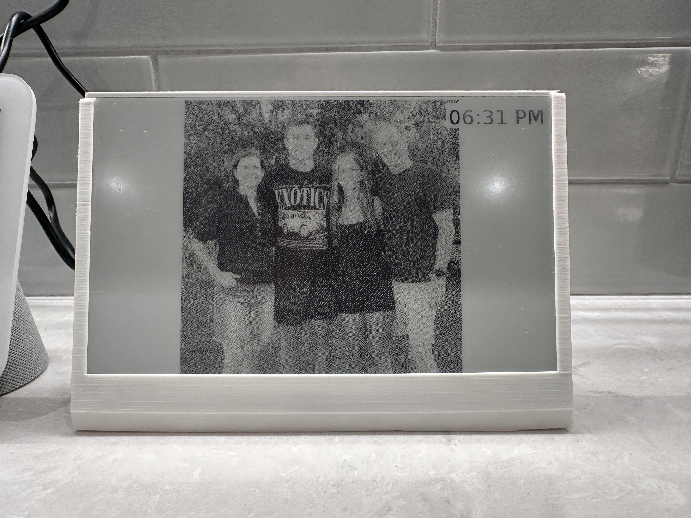

# e-Paper Photo Display



## Introduction

This project transforms a Raspberry Pi Zero 2 W with a Waveshare 7.5-inch e-Paper display into a dynamic photo viewer that fetches images from Firebase Storage and displays them with an overlayed clock. I created this project for my grandparents as a gift for Christmas 2024. They absolutely loved it! It's a wonderful present for anyone who is away from their loved ones and wants a meaningful way to stay connected. This e-Paper display serves as a constant reminder of your presence.


## Components

### Required Parts

- **Waveshare 7.5-inch e-Paper HAT**
  - [Amazon Link](https://www.amazon.com/waveshare-7-5inch-HAT-Raspberry-Consumption/dp/B075R4QY3L)
  
- **Raspberry Pi Zero 2 W**
  - [Amazon Link](https://www.amazon.com/Pi-Zero-WH-Quad-Core-Bluetooth/dp/B0DKKXS4RV?crid=YI1HL92TPU7V&dib=eyJ2IjoiMSJ9.3BENuF2Ktu1UHOlVshSOQf6bxwBq7jmPZ8r4egHwmQD4YWnC1cxI8k4aAVib31h4SQ9AVxwbOINlsdxp5mO9BSAtT1VcDUgsOwsr3lP4aOM9NOaAa1WZS0DGYitEKE4obQfRkkAss_3wKa16dkKLMXtQqrr1hhFdKl9PC0Xp2AEh4WjjUvFeNgjFjR4rkShQFV3OXE0IinLZvYiFEvZFDIqwXxRzOzTwCq45HjiBraigB5YZjqV1ntyiuziIEHNzYRK5B5I8EBNapqCcwSgLBuQZKu0oeSk1_Fs1c6IszFp28wPMIudUfTLXqGyxmYHh1FvHuHpiEI2frNqvZw23cO7u47lJwEsttxCyLGOWG0w.28BQ7UiVo4eZ6HNMGGLdYF7rwu4Yeq6YELBpUmx9dws&dib_tag=se&keywords=raspberry+pi+zero+2+w&qid=1735464168&s=electronics&sprefix=raspberry+pi+ze%2Celectronics%2C169&sr=1-3)
  
- **PLA Filament**
  - Any standard PLA filament for 3D printing.

- **Screws and Nuts**
  - 4x M2.5 screws
  - 4x M2.5 nuts

## 3D Printed Parts

### STL Files

The project includes 3D printable files for the frame of the e-Paper display. You can find them in the `STL` folder:

- **Frame_Base.stl**
- **Frame_Lid.stl**

Use your preferred 3D printing software to print these parts. Ensure that your printer settings match the specifications required for your PLA filament.

## Assembly

1. **Print the Frame:**
   - Use the provided STL files to print `Frame_Base.stl` and `Frame_Lid.stl`.

2. **Assemble the Display:**
   - Attach the Waveshare e-Paper HAT to the Raspberry Pi Zero 2 W using the M2.5 screws and nuts.
   - Secure the Raspberry Pi and e-Paper display within the 3D printed frame.

3. **Connect Power:**
   - Ensure that the Raspberry Pi is connected to a reliable power source.

## Software Setup

### 1. Prepare Your Raspberry Pi

Before proceeding, ensure that your Raspberry Pi Zero 2 W is:

- **Configured with the Latest OS:**
  - Install Raspberry Pi OS Lite for minimal setup.
  
- **Connected to the Network:**
  - Edit the `wpa_supplicant.conf` file to include your Wi-Fi credentials.
  
- **SSH Enabled:**
  - Place an empty file named `ssh` (without any extension) in the `boot` partition of the SD card to enable SSH.

**Example `wpa_supplicant.conf`:**

```conf
country=US
ctrl_interface=DIR=/var/run/wpa_supplicant GROUP=netdev
update_config=1

network={
    ssid="YOUR_WIFI_SSID"
    psk="YOUR_WIFI_PASSWORD"
}
```


### 2. Install Dependencies

Connect to your Raspberry Pi via SSH and install the required packages:

```bash
sudo apt update
sudo apt install -y python3-pip git
pip3 install firebase-admin Pillow schedule requests
pip3 install waveshare-epd
```

**Notes:**

- **Python 3:** Ensure that Python 3 is installed on your Raspberry Pi. You can check the version using:

    ```bash
    python3 --version
    ```

- **pip3:** The Python package installer should be available. If not, install it using:

    ```bash
    sudo apt install -y python3-pip
    ```

- **Waveshare e-Paper Library:** The `waveshare-epd` library is required for interfacing with the e-Paper display. Ensure compatibility with your specific e-Paper model.

### 3. Configure the Script

1. **Clone the Repository:**

    Replace `yourusername` and `your-repo-name` with your actual GitHub username and repository name.

    ```bash
    git clone https://github.com/yourusername/your-repo-name.git
    cd your-repo-name
    ```

2. **Edit the Configuration:**

    Open the `eink.py` script and replace the placeholder paths and settings with your own.

    ```bash
    nano eink.py
    ```

    **Configuration Section:**

    ```python
    # ============================
    # Configuration (replace the following with your own settings)
    # ============================
    
    CACHE_DIR = '/path/to/your/eink_cache'  # REPLACE with your cache directory path
    
    FONT_PATH = "/path/to/your/fonts/DejaVuSans.ttf"  # REPLACE with your font file path
    
    DISPLAY_WIDTH = 800  # REPLACE with your display's width
    DISPLAY_HEIGHT = 480  # REPLACE with your display's height
    
    IMAGE_DISPLAY_DURATION = 300
    CLOCK_UPDATE_INTERVAL = 60
    
    FIREBASE_CREDENTIALS_PATH = "/path/to/your/firebase-service-account.json"  # REPLACE with your Firebase credentials path
    FIREBASE_BUCKET_NAME = "your-firebase-bucket-name.appspot.com"  # REPLACE with your Firebase Storage bucket name
    FOLDER_NAME = "your_photos_folder"  # REPLACE with your Firebase Storage folder name
    
    SETTINGS_COLLECTION = "settings"  # REPLACE if using a different collection name
    SETTINGS_DOCUMENT = "display_settings"  # REPLACE if using a different document name
    ```

    - **CACHE_DIR**: Directory to store cached images.
    - **FONT_PATH**: Path to your TrueType font file.
    - **DISPLAY_WIDTH & DISPLAY_HEIGHT**: Resolution of your e-Paper display.
    - **IMAGE_DISPLAY_DURATION**: Time each image is displayed (in seconds).
    - **CLOCK_UPDATE_INTERVAL**: Interval for clock updates (in seconds).
    - **FIREBASE_CREDENTIALS_PATH**: Path to your Firebase service account JSON file.
    - **FIREBASE_BUCKET_NAME**: Your Firebase Storage bucket name.
    - **FOLDER_NAME**: Folder in Firebase Storage where images are stored.
    - **SETTINGS_COLLECTION & SETTINGS_DOCUMENT**: Firestore collection and document names for display settings.

    **Save and Exit:**

    Press `CTRL + X`, then `Y`, and `Enter` to save the changes and exit the editor.

### 4. Upload Firebase Configuration

Securely transfer your Firebase service account JSON file to the Raspberry Pi. You can use `scp` from your local machine:

```bash
scp /path/to/your/firebase-service-account.json pi@your_pi_ip:/path/to/your/firebase-service-account.json
```

Replace `/path/to/your/firebase-service-account.json` with the actual path on your local machine and `/path/to/your/firebase-service-account.json` with the desired path on the Raspberry Pi.

**Example:**

```bash
scp ~/Downloads/firebase-service-account.json pi@192.168.1.100:/home/pi/your-repo-name/firebase-service-account.json
```

**Ensure Permissions:**

On the Raspberry Pi, set appropriate permissions for the Firebase credentials file:

```bash
chmod 600 /home/pi/your-repo-name/firebase-service-account.json
```

### 5. Set Up Script to Run on Startup

To ensure the script runs automatically after the Raspberry Pi boots and connects to the network, set it up as a systemd service.

1. **Create a Service File:**

    ```bash
    sudo nano /etc/systemd/system/eink.service
    ```

2. **Add the Following Content:**

    ```ini
    [Unit]
    Description=e-Paper Photo Display Service
    After=network-online.target
    Wants=network-online.target

    [Service]
    ExecStart=/usr/bin/python3 /home/pi/your-repo-name/eink.py
    WorkingDirectory=/home/pi/your-repo-name
    StandardOutput=inherit
    StandardError=inherit
    Restart=always
    User=pi

    [Install]
    WantedBy=multi-user.target
    ```

    - **ExecStart**: Path to the Python interpreter and your script.
    - **WorkingDirectory**: Directory where your script is located.
    - **User**: The user to run the script as (`pi` is default).

3. **Reload systemd and Enable the Service:**

    ```bash
    sudo systemctl daemon-reload
    sudo systemctl enable eink.service
    sudo systemctl start eink.service
    ```

4. **Check Service Status:**

    ```bash
    sudo systemctl status eink.service
    ```

    Ensure that the service is active and running without errors.

## Running the Project

Once assembled and configured, the e-Paper display will automatically start displaying images from Firebase Storage and updating the clock based on your settings.

### Adding Images

- **Upload Images to Firebase Storage:**
    - Navigate to your Firebase Console.
    - Go to **Storage** and upload images to the specified `FOLDER_NAME`.

- **Supported Image Formats:**
    - Ensure that the images are in a supported format (e.g., JPEG, PNG).

### Updating Settings

- **Firestore Configuration:**
    - Navigate to **Firestore** in your Firebase Console.
    - Locate the `SETTINGS_COLLECTION` and `SETTINGS_DOCUMENT`.

- **Available Settings:**

    ```json
    {
    "show_clock": true,
    "show_photos": true,
    "timezone": "America/New_York"
    }
    ```

    - **show_clock** (Boolean): Whether to display the clock.
    - **show_photos** (Boolean): Whether to display photos.
    - **timezone** (String): Timezone for the clock (e.g., "America/New_York").

- **Modify Settings:**
    - You can update these settings at any time, and the script will fetch the latest settings based on the configured intervals.

## Troubleshooting

- **Font Not Found:**
    - Ensure the `FONT_PATH` in the script points to a valid TrueType font file.

- **Firebase Initialization Errors:**
    - Verify that the Firebase credentials file exists at the specified path and has the necessary permissions.

- **Display Issues:**
    - Check connections between the Raspberry Pi and the e-Paper display.
    - Ensure the correct e-Paper library (`waveshare-epd`) is installed.

- **Service Not Starting:**
    - Check the status of the systemd service using:

    ```bash
    sudo systemctl status eink.service
    ```

    - Review logs for any errors and ensure all paths in the service file are correct.

- **Network Issues:**
    - Confirm that the Raspberry Pi is connected to the internet.
    - Ensure Wi-Fi credentials are correctly configured in `wpa_supplicant.conf`.

- **Image Download Failures:**
    - Ensure that the images in Firebase Storage are publicly accessible or that the service account has the necessary permissions.
    - Check internet connectivity.

## Contributing

Contributions are welcome! Please follow these steps:

1. **Fork the Repository**

2. **Create a Feature Branch**

    ```bash
    git checkout -b feature/YourFeature
    ```

3. **Commit Your Changes**

    ```bash
    git commit -m "Add your feature"
    ```

4. **Push to the Branch**

    ```bash
    git push origin feature/YourFeature
    ```

5. **Open a Pull Request**

## License

This project is licensed under the [MIT License](LICENSE).

---

Feel free to customize and enhance this project to fit your specific needs. If you encounter any issues or have suggestions, please open an issue or submit a pull request in the repository.